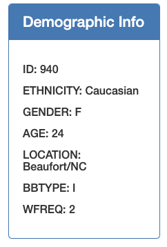
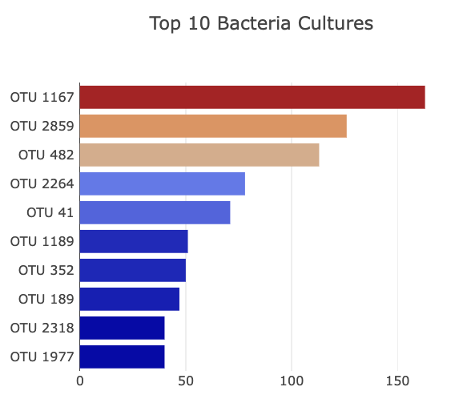
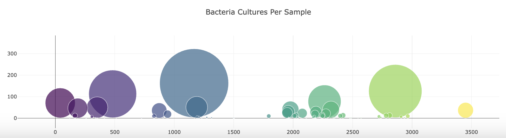
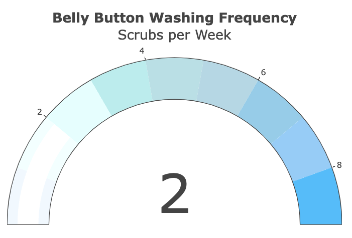
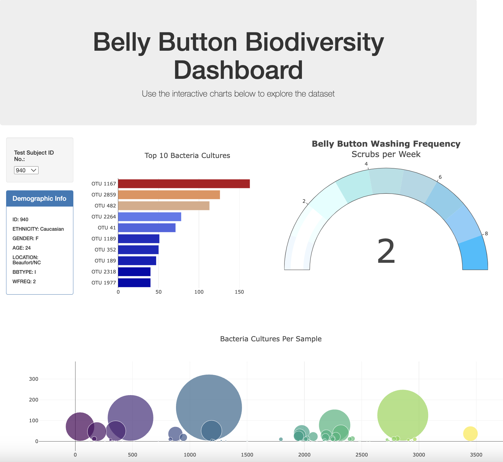

# Belly-Button-Biodiversity

Table of Contents
=================

  * [Background](#background)
  * [Objective](#objective)
  * [Method](#method)
  * [Deployment to Belly Button Biodiversity Dashboard](#deployment-to-belly-button-biodiversity-dashboard)
  * [References](#references)
  
  
  
## Background
  

The challenge was to build an interactive dashboard to explore the `Belly Button Biodiversity dataset`, which catalogs the microbes that colonize human navels.

The dataset revealed that a small handful of microbial species (also called operational taxonomic units, or OTUs, in the study) were present in more than 70% of people, while the rest were relatively rare. 
  
  

## Objective
  

A JavaScript file `app.js` found within the 'Static' Folder was developed containing code to execute the functions required for the creation of the drop down menu containing all subjects IDs. Upon clicking a subject ID, this then executes code to create the three charts for the specified subject ID with the appropriate data display of microbial species.  

Please view the live file here: https://tmard.github.io/Belly-Button-Biodiversity/

## Method
### Create `function init` to Initialize Drop Down Menu

Used D3 to call on the provided URL to create drop down menu.

The drop down menu comprised of the following tasks:

    1. Created a variable holding the subject IDs.
    
    2. Created a variable where D3 should select the data from the specific id tag.
    
    3. Created a for loop for each subject ID and append the values and texts to 
    the appropriate id that was selected. 
    
    4. Used the function redraw to complete all of the functions coded. 

### Create `function redraw` to Call on Selected Subject ID

Used D3 to call on the provided URL to obtain all the appropriate charts for the subject ID that was selected in the drop down menu. 

    

### Create `function DemoInfo` for Demographic Information of Each Subject ID

Used the 'metadata' from the JSON file to complete the following tasks:

    1. Filtered through the 'metadata' to obtain the first subject ID
    
    2. Created a variable where D3 should select the data from the specific id tag.
    
    3. Created a for loop to append the values and keys to the id tag. 
   
    

### Create `function AllCharts` for Horizontal, Bubble and Gauge Charts

Used the 'samples' and 'metadata' data from the JSON file to create three charts. 

The charts comprised of the following tasks:

    1. Horizontal Chart: 
        a. Used `samples_values` as the values.
        b. Used `otu_ids` as labels. 
        c. Used `otu_labels` as hovertext for the chart. 
   
        
        
    2. Bubble Chart:
        a. Use `otu_ids` for the x values.
        b. Use `sample_values` for the y values.
        c. Use `sample_values` for the marker size.
        d. Use `otu_ids` for the marker colors.
        e. Use `otu_labels` for the text values.

        
        
    3. Gauge Chart:
        a. Plot weekly washing frequency of the subject.

    

## Deployment of Belly Button Biodiversity Dashboard

## References

Hulcr, J. et al. (2012) A Jungle in There: Bacteria in Belly Buttons are Highly Diverse, but Predictable. Retrieved from: http://robdunnlab.com/projects/belly-button-biodiversity/results-and-data/

* Dataset provided by edX UofT Data Analytics, which had been generated by Trilogy Education Services, LLC. 

- - -
